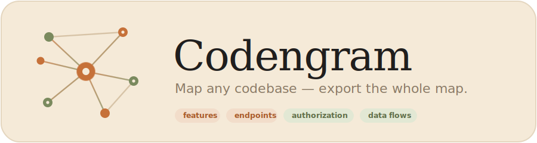
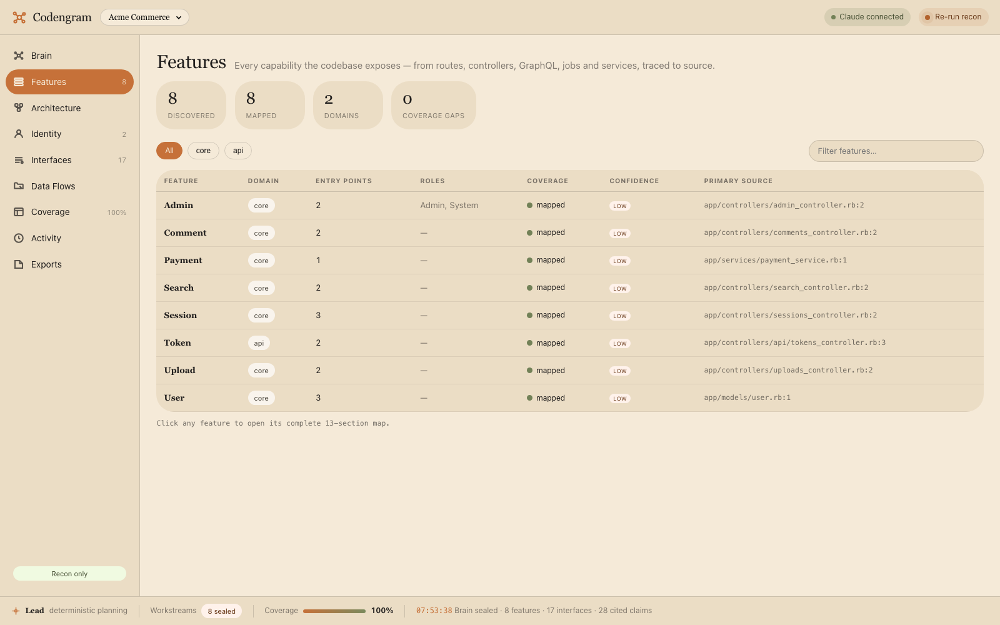
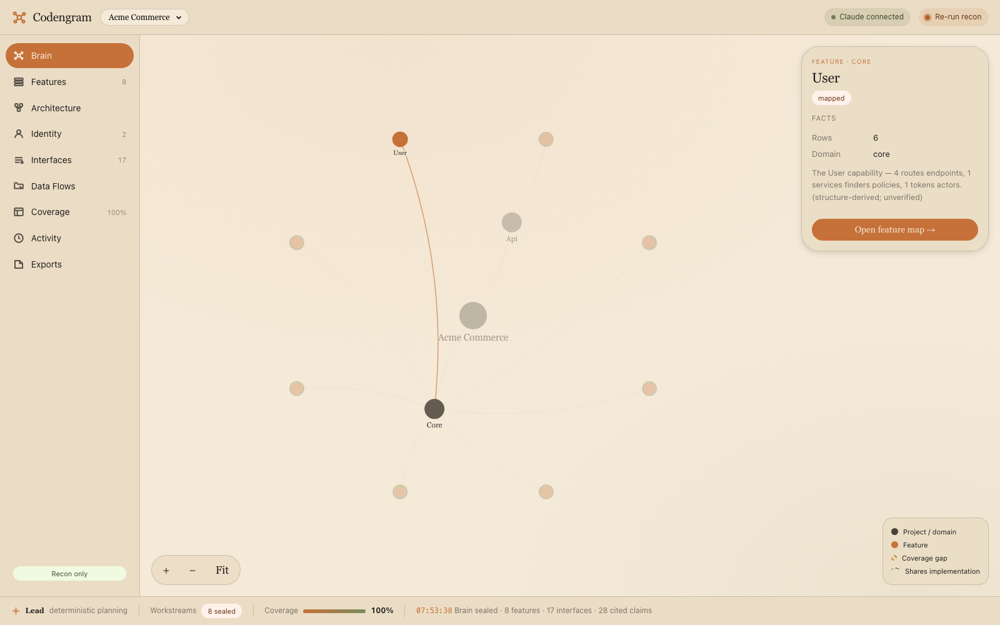
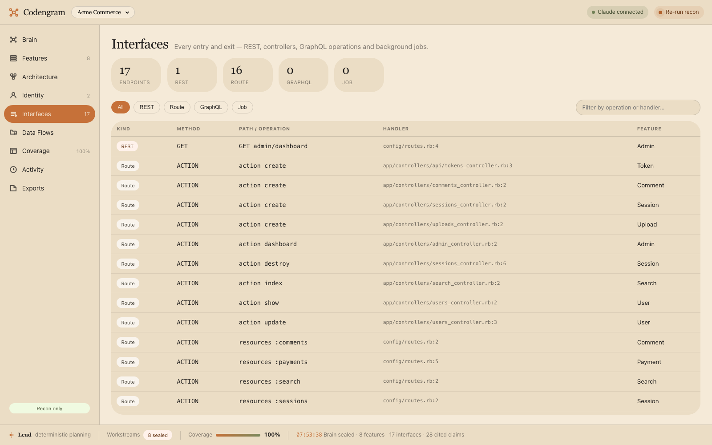
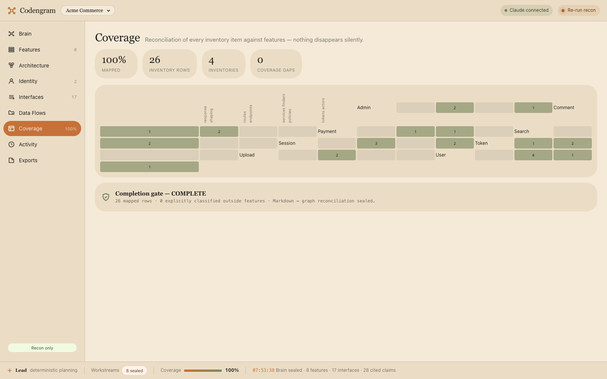

<div align="center">



**Map any source code into a structured, cited map — then export the whole thing.**

Codengram reads a repository and turns it into a **map of the system**: every feature, endpoint, route, background job, authorization check, role, service, and data flow — each grounded to a `file:line` in a frozen snapshot of the source. Explore it in a local UI, or **export the entire mapping** and use it wherever you need to understand the code by feature: security review, static code review, onboarding, architecture docs, or as ready-made context for an AI.

[](#license)
[](https://nodejs.org)
[](#)
[](#recon-only)

</div>

<p align="center"></p>

> **Recon only.** Codengram maps *structure and understanding* — who exposes what, which auth checks exist, where data flows, which features share code. It **never** claims a vulnerability, exploit, or severity. What you do with the map is up to you.

---

## Setup

Needs **Node ≥ 22** (uses Node's built-in SQLite — no native build). That's it.

```bash
git clone https://github.com/ghostshift-content/codengram.git && cd codengram
npm install

npm run doctor        # check your environment (Node, SQLite, data dir, port, Claude)
npm run serve         # open the UI  →  http://127.0.0.1:4173
```

`doctor` prints a clear ✓ / ⚠ / ✗ report and tells you how to fix anything that's off. **`serve` and `scan` run this preflight automatically** and refuse to start if something's broken — so problems show up front, never mid-run.

In the UI: paste a **local repository path** → **Recon** → watch it map, then explore **Features → Interfaces → Authorization → Data Flows → Coverage**, and **Ask** questions with cited answers.

Prefer the terminal:

```bash
npm run scan -- /path/to/your/repo     # map a repo → writes a portable bundle
node apps/cli/bin/codengram.js ls      # list mapped projects
```

**AI is optional.** Everything runs **deterministically** with no AI. To enable Claude-backed answers, install [Claude Code](https://claude.ai/code) and run `claude` once to log in — Codengram uses your existing subscription and **never handles credentials**. Without it, `Ask` and the mapping still work, just with structure-derived text instead of model reasoning. Check your login any time with:

```bash
npm run doctor -- --probe              # also verifies your Claude subscription session
```

---

## What it maps

Every scan produces a graph of the codebase, reconciling **every** inventory item to a terminal state (nothing is silently dropped):

| Layer | What Codengram extracts |
|---|---|
| **Features** | Capabilities clustered from routes, controllers, services — each a 13-section document |
| **Interfaces** | REST routes, GraphQL operations, background jobs — method, path, handler, source |
| **Authorization** | Policies, `before_action`/guards, roles, permissions found in code |
| **Data flows** | Feature → service / integration / data store, with trust-boundary crossings |
| **Coverage** | Per-item reconciliation + a completion gate — honest about what's mapped vs. a gap |

Every claim carries provenance: **snapshot + file + line + confidence + how it was found.**

---

## Export the map

Each scan writes a self-contained bundle you can hand to anything:

```
phase1-maps/
  AI_CONTEXT.md          # a fresh AI session understands the whole codebase, zero prior context
  features/<slug>.md     # per-feature map (identity, entry points, authz, data, files) — all cited
  graph/nodes.jsonl      # the machine-readable graph
  graph/edges.jsonl      # canonical from → to
  consolidated/          # feature index, coverage matrix, completion gate
```

Use it for:

- **Security review** — jump straight to a feature's endpoints, auth checks, and data flows, each at `file:line`.
- **Static code review by feature** — review one capability end-to-end instead of guessing across the tree.
- **Onboarding & architecture docs** — a real map of what exists and how it connects.
- **AI context** — drop `AI_CONTEXT.md` + the graph into any model and ask about the code with citations.

---

## A look inside

| Neural map | Interfaces | Coverage |
|---|---|---|
|  |  |  |

---

## How it works

1. **Freeze** — snapshot the source (content-addressed, immutable) so every citation resolves against exactly what was scanned.
2. **Inventory** — deterministic, per-language extraction of routes, APIs, jobs, services, policies, data stores.
3. **Map** — cluster inventory into features and build a knowledge graph with provenance on every node/edge.
4. **Reconcile & seal** — every item reaches a terminal status; artifacts are validated, then the snapshot is **atomically published**.
5. **Serve & export** — explore in the UI, ask cited questions, or export the portable bundle.

Local-first, runs on your machine, source is read-only — deletion only ever touches Codengram's own `data/`.

<a name="recon-only"></a>
## Recon only

Codengram is a **mapping** tool, not a scanner. It reports what the code *is and does*, never a verdict about whether it's safe. The optional AI path is guarded on both sides to keep it that way — questions and generated text that read like vulnerability findings are refused, so the map stays a map.

## License

MIT.
